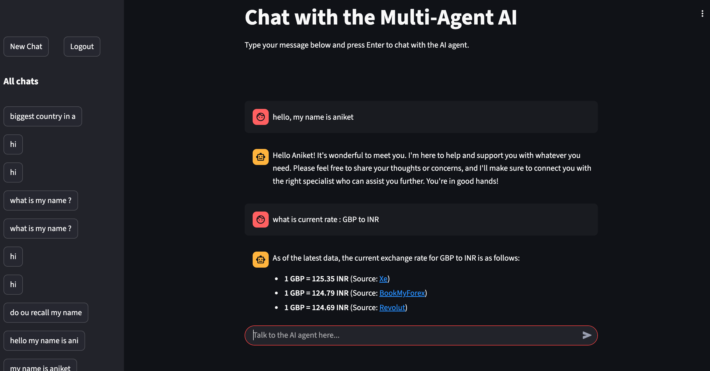
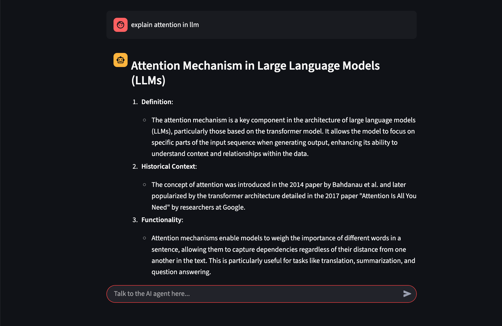
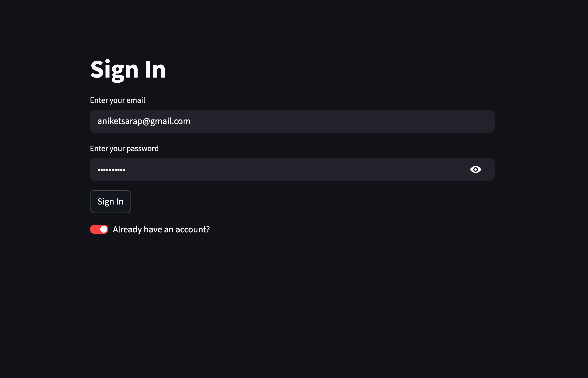
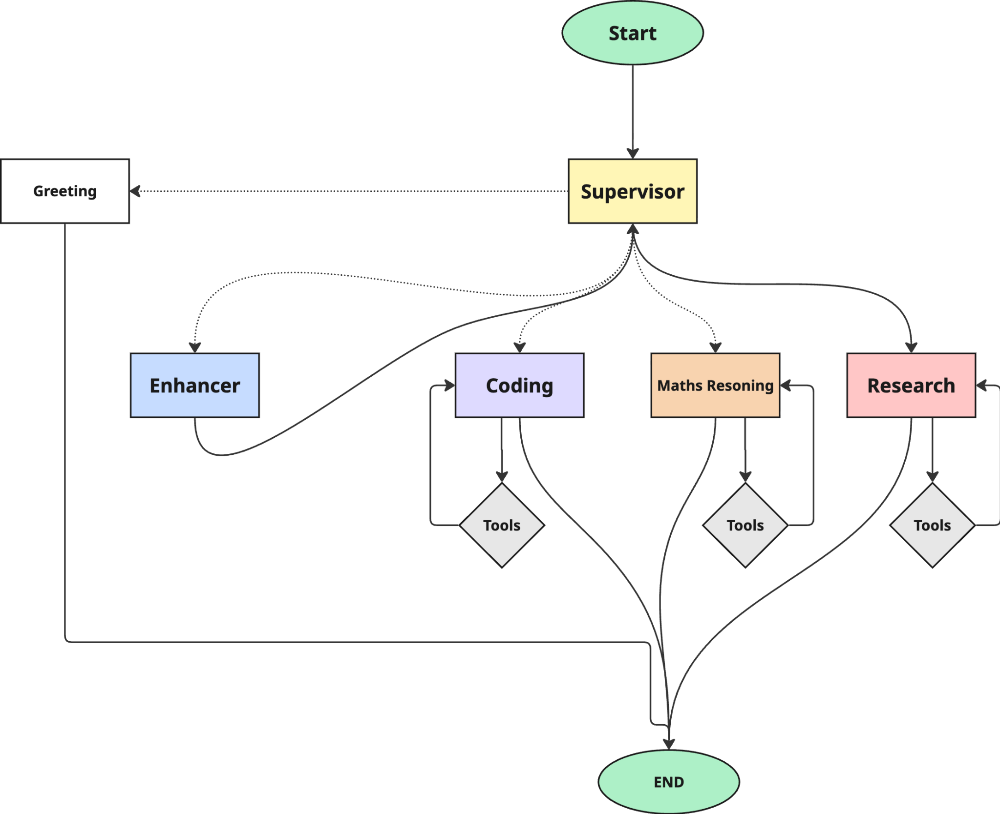
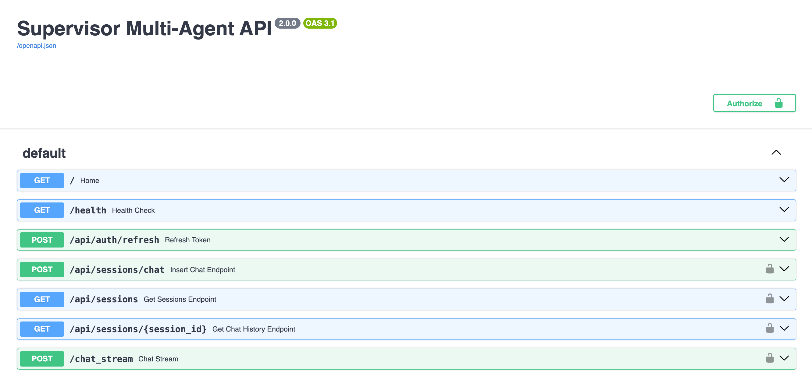
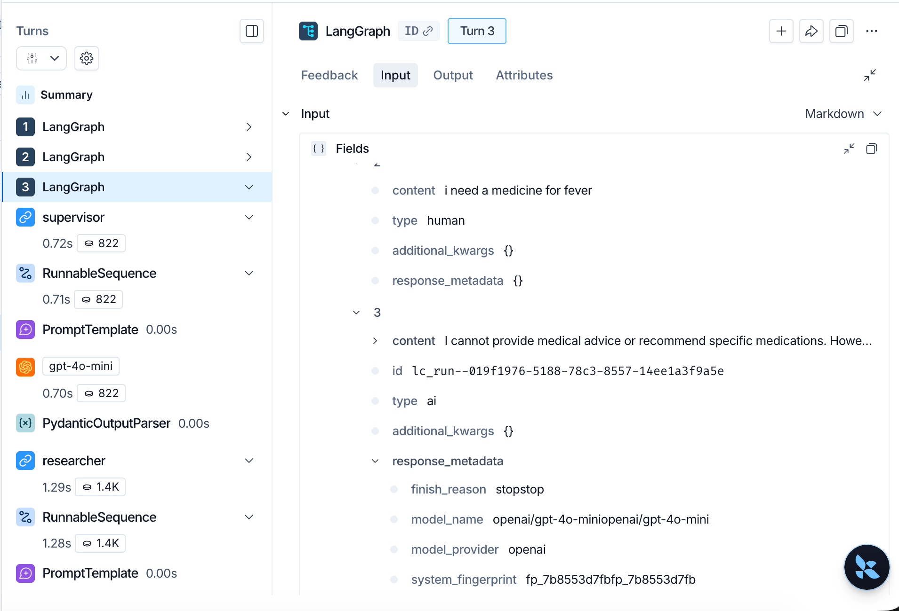

# Enterprise Documentation Assistant (POC)

A production-grade LangGraph architecture demonstrating structured query analysis, deterministic routing, RAG-backed knowledge retrieval, and bounded agent autonomy — built as a proof of concept for enterprise documentation assistance.


## Table of Contents

- [Core Tech Stack](#core-tech-stack)
- [Project Overview](#project-overview)
- [Preview](#preview)
- [Architecture](#architecture)
- [Agent System](#agent-system)
- [Conversation Module](#conversation-module)
- [Knowledge Base & RAG](#knowledge-base--rag)
- [Engineering Decisions](#engineering-decisions)
- [API Endpoints](#api-endpoints)
- [Configuration](#configuration)
- [Project Structure](#project-structure)
- [Quick Start](#quick-start)
- [Docker](#docker)
- [Google Cloud Deployment](#google-cloud-deployment)
- [CI/CD Pipeline](#cicd-pipeline)
- [Roadmap](#roadmap)
- [Version 2 — State Separation & Prompt Builder](#version-2--state-separation--prompt-builder)
- [Multi-Intent Query Handling](#multi-intent-query-handling)

## Core Tech Stack


## Project Overview

This project validates a **production LangGraph architecture** for enterprise documentation assistance. Instead of a single general-purpose model or a supervisor that classifies requests, the system uses:

- **Structured Query Analysis** — a single LLM call produces a typed `QueryAnalysis` object with intent, entities, confidence, and clarification flags
- **Deterministic Router** — routes to one of four specialist agents based on `QueryAnalysis.intent`, no LLM involved
- **Conversation Module** — separates persistent conversation memory from LangGraph's `GraphState`, enabling active filters and multi-turn context
- **RAG-backed Knowledge Agent** — retrieves from a FAISS vector store built from PDF documentation, returns responses with citations
- **Bounded Coding Agent** — implemented via `create_react_agent` with isolated tools (Python REPL, Calculator) that no other agent can access
- **Escalation Agent** — generates support tickets when `requires_human=True`

## Preview

| Chat UI | Streaming Chat |
|---|---|
|  |  |

| User Auth | Agent Workflow |
|---|---|
|  |  |

| FastAPI | LangSmith |
|---|---|
|  |  |

## Architecture

### Graph Flow

```text
User
  │
  ▼
Streamlit UI
  │
  ▼
FastAPI /chat_stream
  │
  ▼
ConversationModule (load state + active filters)
  │
  ▼
Query Analysis (LLM → structured output)
  │
  ▼
Router (deterministic — no LLM)
  │
  ├──► Conversation Agent  → END
  ├──► Knowledge Agent     → END
  ├──► Coding Agent        → END
  └──► Escalation Agent    → END
  │
  ▼
ConversationModule (persist state + filters)
  │
  ▼
SSE Streamed Response
```

### Backend Flow

```text
POST /chat_stream
  │
  +-- Validate Supabase JWT
  │
  +-- ConversationModule.load_state(thread_id)
  │
  +-- Build GraphState: recent messages + active filters
  │
  +-- Clear filters if topic_changed (from previous turn)
  │
  +-- Stream LangGraph events (skip query_analysis output)
  │
  +-- ConversationModule.save_state(updated messages + filters)
  │
  +-- Emit SSE chunks to client
```

### Session Persistence Flow

```text
User message
  │
  +-- Streamlit saves human message through POST /api/sessions/chat
  │
  +-- Backend writes to Supabase session table
  │
  +-- Agent streams response
  │
  +-- Streamlit saves AI response through POST /api/sessions/chat
  │
  +-- Sidebar reloads session summaries
```

## Agent System

| Agent | Purpose | Tools | Routing Trigger |
|---|---|---|---|
| **Conversation** | Greetings, thanks, goodbye, casual chat | None | `intent == "conversation"` |
| **Knowledge** | RAG-based documentation lookup | FAISS retriever | `intent == "knowledge"` |
| **Coding** | Code generation, debugging, execution | Python REPL, Calculator | `intent == "coding"` |
| **Escalation** | Human handoff simulation | Ticket generation | `intent == "escalation"` or `requires_human == True` |

### Query Analysis

A single LLM call produces a structured `QueryAnalysis` object:

```python
class QueryAnalysis(BaseModel):
    resolved_query: str           # Self-contained query with context
    intent: Literal["conversation", "knowledge", "coding", "escalation"]
    entities: dict                # Extracted entities for active filters
    confidence: float             # 0.0–1.0 classification confidence
    requires_human: bool          # Human intervention needed
    clarification_needed: bool    # Query too vague/broad
    clarification_question: str   # Question to ask if clarification needed
    topic_changed: bool           # Signal to clear active filters
```

### Active Filters

Typed model for tracking context across turns:

```python
class ActiveFilters(BaseModel):
    framework: str | None   # e.g., FastAPI, LangGraph, Docker
    library: str | None     # e.g., langchain, pydantic
    language: str | None    # e.g., Python, TypeScript
    topic: str | None       # e.g., Memory, Agents, RAG
```

When `topic_changed=True`, filters are cleared automatically for the next turn.

## Conversation Module

The **Conversation Module** is the source of truth for conversation memory, separate from LangGraph's `GraphState`.

```text
Conversation Module (persistent)
    │
    ├── load_state()     → injects working copy into GraphState
    ├── save_state()     → persists after graph execution
    └── clear_filters()  → resets when topic changes
```

For the POC, uses in-memory storage. Replace with Supabase/RDS PostgreSQL in production without touching any LangGraph code.

## Knowledge Base & RAG

### Ingestion Pipeline

```text
PDFs in knowledge_base/
    │
    ▼
PyPDFLoader → chunks (500 chars, 50 overlap)
    │
    ▼
Metadata: source_type, framework, document, version
    │
    ▼
OpenAI embeddings (text-embedding-3-small)
    │
    ▼
FAISS vector store → saved to faiss_index/
```

### Current Knowledge Base

| Document | Framework | Pages |
|---|---|---|
| LangGraph overview | LangGraph | 4 |
| FastAPI tutorial | FastAPI | 123 |
| FastAPI reference | FastAPI | 115 |
| Advanced FastAPI | FastAPI | 2 |
| Docker Docs | Docker | 2 |
| Docker for Beginners | Docker | 138 |
| Python reference | Python | 3 |

### Usage

```bash
python ingest_docs.py
```

The Knowledge Agent retrieves top-4 chunks with metadata and generates responses with source citations.

## Engineering Decisions

### Why structured Query Analysis instead of a supervisor?

A supervisor that classifies and routes in one step gives no visibility into *why* a route was chosen. Structured output provides intent, confidence, entities, and clarification flags — enabling deterministic routing, observability, and multi-turn context tracking.

### Why a deterministic router?

Once `QueryAnalysis` produces a typed intent, routing is a simple conditional. No LLM call needed. This reduces latency, cost, and non-determinism.

### Why a separate Conversation Module?

LangGraph's checkpoint stores graph execution state, not conversation memory. Separating them allows:
- Persistent active filters across turns
- Topic change detection and filter clearing
- Swappable storage backends (in-memory → Supabase → RDS) without touching graph code

### Why FAISS for RAG?

FAISS is lightweight, fast, and sufficient for the POC. Production can migrate to pgvector or a managed vector database without changing the `knowledge_node` interface.

### Why `create_react_agent` for coding?

`create_react_agent` provides built-in tool-calling loops with proper state management. Bounding tools to this agent enforces the locked architecture principle: each agent owns its tools.

### Why FastAPI and Streamlit?

FastAPI handles authenticated API routes, streaming, health checks, and backend-owned persistence. Streamlit keeps the frontend lightweight while supporting chat UX, auth flow, session history, and streaming updates.

### Why Supabase?

Supabase provides authentication, database persistence, and JWT validation in one system. Backend-controlled writes through the service key keep identity and data access secure.

### Why server-sent events?

SSE is simpler than WebSockets for one-way LLM streaming. The client sends one request, then receives incremental chunks until the backend emits an end event.

### Why optional Postgres checkpointing?

For local development, `MemorySaver` keeps the setup simple. In production, `SUPABASE_DB_URL` enables LangGraph Postgres checkpointing so conversation state survives process restarts.

## API Endpoints

| Endpoint | Method | Auth | Purpose |
|---|---|---|---|
| `/` | GET | No | Service welcome response |
| `/health` | GET | No | Health and uptime check |
| `/chat_stream` | POST | Yes | Stream agent response over SSE |
| `/api/auth/refresh` | POST | No | Refresh Supabase session token |
| `/api/sessions` | GET | Yes | List user chat sessions |
| `/api/sessions/{session_id}` | GET | Yes | Fetch chat history for a session |
| `/api/sessions/chat` | POST | Yes | Persist one chat message |

## Configuration

Create a `.env` file with the required values.

| Variable | Required | Description |
|---|---|---|
| `OPENROUTER_API_KEY` | Yes | API key for OpenRouter model access |
| `SUPABASE_URL` | Yes | Supabase project URL |
| `SUPABASE_KEY` | Yes | Supabase anon key used by frontend auth |
| `SUPABASE_SERVICE_KEY` | Yes | Supabase service role key used by backend DB operations |
| `SUPABASE_JWT_SECRET` | Yes | JWT secret for HS256 Supabase tokens |
| `SUPABASE_DB_URL` | No | Postgres URL for LangGraph checkpointing |
| `TAVILY_API_KEY` | No | Enables Tavily web search tool (legacy) |
| `LANGCHAIN_TRACING_V2` | No | Enables LangSmith tracing |
| `LANGCHAIN_ENDPOINT` | No | LangSmith endpoint |
| `LANGCHAIN_API_KEY` | No | LangSmith API key |
| `LANGCHAIN_PROJECT` | No | LangSmith project name |
| `LLM_PROVIDER` | No | `openrouter`, `groq`, or `openai` |
| `LLM_MODEL` | No | Model name, defaults to `gpt-4o-mini` |
| `LLM_TEMPERATURE` | No | Model temperature, defaults to `0.2` |
| `BACKEND_URL` | Frontend | Backend API URL for Streamlit |
| `CORS_ORIGINS` | No | Comma-separated allowed origins |

## Project Structure

```text
├── backend/
│   ├── ai_agent.py              # LangGraph graph construction and checkpointing
│   ├── auth.py                  # Supabase JWT validation dependencies
│   ├── conversation_module.py   # Conversation memory abstraction (new)
│   ├── fastapi_backend.py       # FastAPI app, routes, streaming endpoint
│   └── supabase_database.py     # Supabase auth and chat persistence helpers
├── frontend/
│   └── streamlit_frontend.py    # Streamlit auth, chat UI, SSE client
├── knowledge_base/              # PDF documents for RAG (new)
├── faiss_index/                 # Generated FAISS vector store (gitignored)
├── assets/
│   ├── chatbot_ui_1.png
│   ├── chatbot_ui_2.png
│   ├── user_auth.png
│   ├── workflow.png
│   ├── fastapi.png
│   └── langsmith.png
├── utils.py                     # Agent state, tools, LLM factory, graph nodes
├── ingest_docs.py               # PDF ingestion script (new)
├── requirements.txt             # Shared dependencies
├── requirements-backend.txt     # Backend dependencies
├── requirements-frontend.txt    # Frontend dependencies
├── Dockerfile.backend           # Backend image
├── Dockerfile.frontend          # Frontend image
├── docker-compose.yml           # Local backend/frontend orchestration
├── cloudbuild.yaml              # Google Cloud Build and Cloud Run deployment
└── README.md
```

## Quick Start

### 1. Clone

```bash
git clone https://github.com/aniketsarapAI/Supervisor-AWS.git
cd Supervisor-AWS
```

### 2. Create virtual environment

```bash
python3.12 -m venv .venv
source .venv/bin/activate
```

### 3. Install dependencies

```bash
pip install -r requirements-backend.txt
pip install -r requirements-frontend.txt
pip install faiss-cpu pypdf
```

### 4. Create environment file

Create `.env` using the variables from the [Configuration](#configuration) table.

### 5. Build FAISS index

```bash
python ingest_docs.py
```

Add PDFs to `knowledge_base/` before running. The script chunks, embeds, and indexes them into `faiss_index/`.

### 6. Start the backend

```bash
python -m uvicorn backend.fastapi_backend:app --reload --port 8000
```

> **Important:** Always use `python -m uvicorn` (not the global `uvicorn` binary) to ensure the venv's Python is used.

### 7. Start the frontend

```bash
python -m streamlit run frontend/streamlit_frontend.py
```

> **Important:** Always use `python -m streamlit` (not the global `streamlit` binary) to ensure the venv's Python is used.

The Streamlit app runs on:

```text
http://localhost:8501
```

The FastAPI docs run on:

```text
http://localhost:8000/docs
```

## Docker

Run both services locally:

```bash
docker compose up --build
```

Services:

| Service | URL |
|---|---|
| Backend API | `http://localhost:8000` |
| Streamlit UI | `http://localhost:8501` |

## Google Cloud Deployment

This repo includes `cloudbuild.yaml` for Google Cloud Build and Cloud Run. Deployment to production is fully automated using Google Cloud Build. See the **CI/CD Pipeline** section below for the deployment workflow.

The deployment builds and pushes:

- `sma-api` from `Dockerfile.backend`
- `sma-ui` from `Dockerfile.frontend`

The backend is deployed first. Cloud Build captures the backend Cloud Run URL and injects it into the frontend as `BACKEND_URL`.

Secrets expected in Google Secret Manager:

- `sma-openrouter-key`
- `sma-tavily-key`
- `sma-supabase-url`
- `sma-supabase-anon-key`
- `sma-supabase-service-key`
- `sma-jwt-secret`
- `sma-supabase-db-url`
- `sma-langsmith-key`

## CI/CD Pipeline

### Overview

This project uses Google Cloud Build, GitHub, Artifact Registry, and Cloud Run to automatically build and deploy the application to production whenever code is pushed to the `main` branch. The entire deployment process is fully automated, eliminating the need for manual Docker builds or Cloud Run deployments.

### Architecture

```text
Developer
      │
git push origin main
      │
      ▼
GitHub
      │
      ▼
Cloud Build Trigger
      │
      ▼
Build Backend Image
      │
      ▼
Build Frontend Image
      │
      ▼
Push Images to Artifact Registry
      │
      ▼
Deploy sma-api
      │
      ▼
Retrieve Backend URL
      │
      ▼
Deploy sma-ui
      │
      ▼
Production Updated
```

### Deployment Workflow

#### 1. Developer Pushes Code

After completing development locally:

```bash
git add .
git commit -m "Implemented feature"
git push origin main
```

Pushing to the `main` branch automatically starts the deployment pipeline.

#### 2. Cloud Build Trigger

A Cloud Build trigger is configured with:

- Repository: `aniketsarapAI/Supervisor-AWS`
- Event: Push to branch
- Branch regex: `^main$`

Whenever GitHub receives a push to `main`, Cloud Build starts automatically.

#### 3. Cloud Build Executes `cloudbuild.yaml`

Cloud Build reads the repository's `cloudbuild.yaml` file and performs the deployment steps.

#### 4. Build Docker Images

Two Docker images are built:

| Image | Dockerfile | Service |
|---|---|---|
| `sma-api` | `Dockerfile.backend` | Backend |
| `sma-ui` | `Dockerfile.frontend` | Frontend |

#### 5. Push Images to Artifact Registry

The newly built Docker images are uploaded to Google Artifact Registry:

```text
us-central1-docker.pkg.dev/<PROJECT_ID>/supervisor-aws/sma-api
us-central1-docker.pkg.dev/<PROJECT_ID>/supervisor-aws/sma-ui
```

Artifact Registry stores versioned container images used by Cloud Run.

#### 6. Deploy Backend

Cloud Build deploys the backend service first. During deployment it:

- Creates a new Cloud Run revision
- Injects Secret Manager secrets
- Configures environment variables
- Routes traffic to the new healthy revision

Injected configuration includes OpenRouter API key, Tavily API key, Supabase credentials, LangSmith API key, and LLM configuration.

#### 7. Obtain Backend URL

After deployment succeeds, Cloud Build retrieves the backend URL dynamically:

```bash
gcloud run services describe sma-api
```

Example:

```text
https://sma-api-xxxxx-uc.a.run.app
```

#### 8. Deploy Frontend

The frontend is deployed after the backend. The backend URL is injected into the frontend environment:

```text
BACKEND_URL=https://sma-api-xxxxx-uc.a.run.app
```

This ensures the frontend always communicates with the latest backend deployment.

#### 9. Production Update

Once both deployments complete successfully, backend and frontend traffic is switched to the newest revisions. The production application is updated automatically.

### Google Cloud Services

| Service | Purpose |
|---|---|
| GitHub | Source code management |
| Cloud Build | Continuous Integration & Deployment |
| Artifact Registry | Container image storage |
| Cloud Run | Container hosting |
| Secret Manager | Secure secret storage |

### Secrets Management

Sensitive credentials are never stored in the repository. All production secrets are stored in Google Secret Manager and injected during deployment.

This includes:

- OpenRouter API key
- Tavily API key
- Supabase URL
- Supabase anon key
- Supabase service key
- Supabase JWT secret
- Supabase database URL
- LangSmith API key

### Automatic Deployment

The Cloud Build trigger is configured to watch the `main` branch. Every push to `main` automatically starts the build and deployment pipeline.

No manual deployment is required. Example:

```bash
git add .
git commit -m "Added RAG knowledge agent"
git push origin main
```

Within a few minutes, the production environment is updated automatically.

### Rollback

Cloud Run retains previous revisions. If a deployment introduces an issue, traffic can be shifted back to any previous healthy revision from the Cloud Run console without rebuilding or redeploying the application.

### Benefits

- Automated production deployments
- Versioned container images
- Secure secret management
- Cloud-native deployment
- Simple rollback
- No manual deployment after pushing to `main`

## Roadmap

### Production Hardening

- Add `.env.example` with documented safe defaults
- Add automated backend tests for auth, sessions, and streaming
- Add frontend smoke tests
- Add rate limiting on chat and session endpoints
- Add request and response validation for tool outputs
- Add structured error responses across all endpoints

### Agent Improvements

- Add stronger output validation for each specialist agent
- Add evaluator or critic node for high-risk responses
- Add explicit source citations for researcher outputs
- Add safer execution boundaries around Python REPL
- Add configurable provider fallback between OpenRouter, Groq, and OpenAI
- Add progressive clarification loop for broad Knowledge Agent queries

### Platform Improvements

- Add Redis or Postgres-backed rate limiting
- Add metrics endpoint for request count, latency, errors, and active streams
- Add OpenTelemetry tracing
- Add automated linting (Ruff)
- Add automated unit and integration tests
- Add deployment health checks and quality gates
- Add staging environment
- Add canary/blue-green deployments
- Migrate FAISS to pgvector for production RAG
- Migrate Conversation Module from in-memory to Supabase/RDS PostgreSQL
- Migrate from Google Cloud Run to AWS (ECS, RDS, Bedrock, ECR, ALB)

### Version 2 — State Separation & Prompt Builder

Refactor the state model to separate persistent conversation memory from per-request graph execution, making the architecture domain-agnostic:

**New `ConversationState`** (persistent, owned by `ConversationModule`):
- `summary: str` — rolling conversation summary
- `recent_messages: list[dict]` — Human/AI messages only (no System/Tool/execution noise)
- `working_memory: dict[str, Any]` — domain-agnostic slot storage (replaces `ActiveFilters`)
- `metadata: dict[str, Any]` — last agent, latency, etc.

**New `GraphState`** (per-request, checkpointed by LangGraph):
- `messages: list[BaseMessage]` — full execution history (System, Human, AI, Tool)
- `resolved_query: str` — renamed from `current_query`
- `query_analysis: QueryAnalysis | None`
- `context: Any | None` — unified field for retrieved docs, tool output, etc.
- `agent_result: Any | None` — typed output per agent (e.g., `KnowledgeResult`, `CodingResult`)
- `status: ExecutionStatus` — enum: `RUNNING`, `SUCCESS`, `FAILED`, `RETRY`

**Shared Prompt Builder**:
- `build_agent_messages()` — single utility used by every agent node
- Consistent prompt layout, easier debugging, one place to optimize tokens
- Each agent constructs its own prompt scope — no leaking system prompts between agents

**Removes**:
- `ActiveFilters` class — replaced by `working_memory` (reusable across documentation assistant, London Stone, healthcare, or any domain)

This refactoring is the foundation for reusing the architecture in customer support, e-commerce, or any other LangGraph system without changing the state model.

### Multi-Intent Query Handling

Handle queries containing multiple distinct intents in a single message (e.g., "hello, write code and also what is FastAPI"):

- **Multi-intent detection** — Query Analysis detects when a single message contains multiple intents
- **Intent splitting** — Split the resolved query into N independent sub-queries
- **Fan-out execution** — Execute each sub-query through its own agent path (conversation, coding, knowledge)
- **Response merging** — Combine results from all agents into a single coherent response

Architecture options to evaluate:
- Parallel node execution via `Command(goto=[...])` (LangGraph fan-out)
- Sequential processing with a coordinator agent
- Sub-graph spawning for each intent
